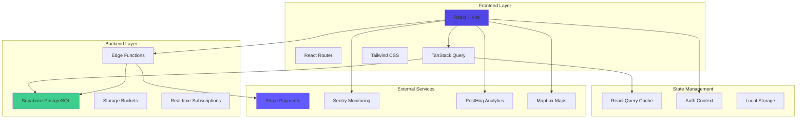
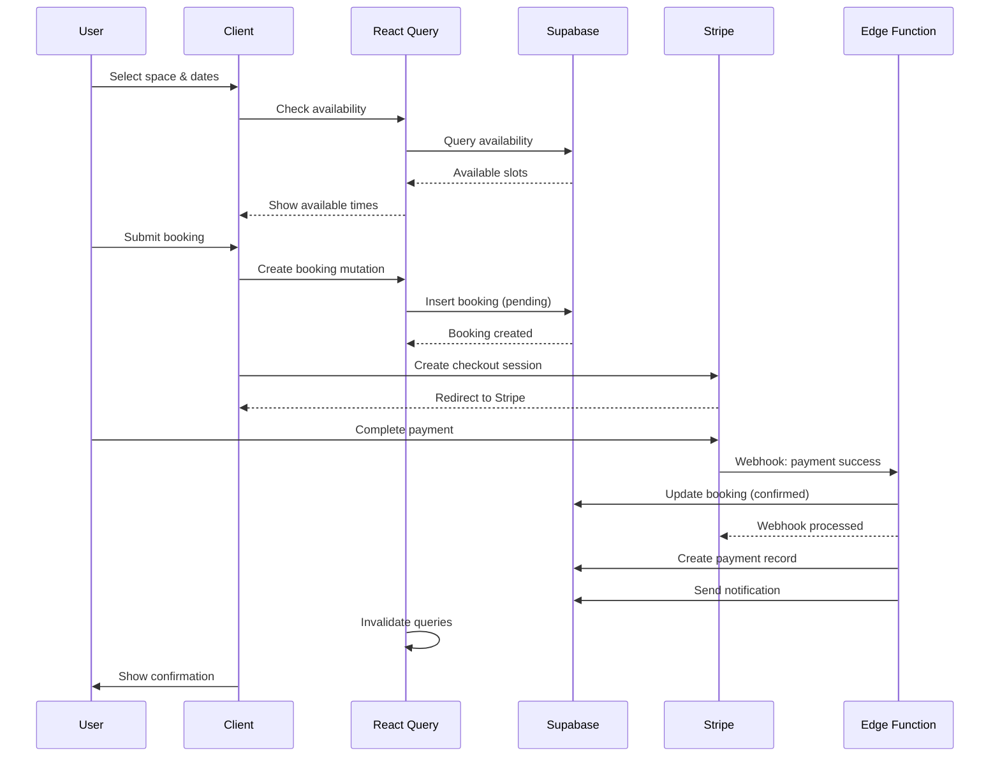
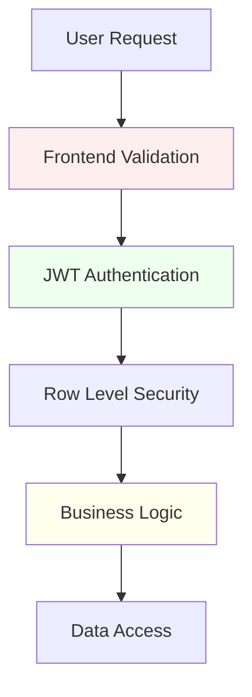

# 🏗️ Architecture Documentation

## System Overview

WorkOver is a full-stack web application built with React/Vite frontend and Supabase backend, designed to connect coworkers with workspace hosts.



## Technology Stack

### Frontend
- **Framework**: React 18 + TypeScript
- **Build Tool**: Vite (SWC compiler)
- **State Management**: React Query (TanStack Query)
- **Routing**: React Router v6
- **Styling**: Tailwind CSS + CSS Variables
- **UI Components**: Radix UI + shadcn/ui
- **Forms**: React Hook Form + Zod
- **Animations**: Framer Motion

### Backend
- **Database**: Supabase PostgreSQL
- **Authentication**: Supabase Auth (JWT-based)
- **Storage**: Supabase Storage (S3-compatible)
- **Edge Functions**: Deno-based serverless functions
- **Real-time**: Supabase Realtime (WebSockets)

### Infrastructure
- **Hosting**: Lovable Platform / Vercel
- **CDN**: Cloudflare / Vercel Edge Network
- **Monitoring**: Sentry + Custom SRE Dashboard
- **Analytics**: PostHog
- **Payments**: Stripe Connect
- **Maps**: Mapbox

## Component Architecture

```
src/
├── components/
│   ├── ui/                    # Base UI components (shadcn)
│   ├── spaces/                # Space listing & details
│   ├── bookings/              # Booking flow
│   ├── messages/              # Messaging system
│   ├── admin/                 # Admin dashboard
│   ├── auth/                  # Authentication
│   ├── security/              # Security components
│   └── error/                 # Error boundaries
├── hooks/
│   ├── auth/                  # Auth hooks
│   ├── queries/               # React Query hooks
│   └── ...                    # Custom hooks
├── lib/                       # Utilities
├── pages/                     # Route components
└── integrations/              # External services
```

## State Management

### Server State (React Query)
- Handles API data fetching, caching, and synchronization
- Automatic background refetching
- Optimistic updates for mutations
- Query invalidation strategies

### Client State (React Context)
- `AuthContext`: User authentication state
- `GDPRContext`: Cookie consent management
- `ThemeContext`: Dark/light mode

### UI State (Local State)
- Component-level state with `useState`
- Form state with React Hook Form

## Data Flow

### Booking Flow Example


## Security Architecture

### Multi-Layer Security



### Security Layers

1. **Frontend**
   - Input sanitization (DOMPurify)
   - CSP headers
   - XSS protection

2. **Authentication**
   - JWT tokens (Supabase Auth)
   - Secure session management
   - OAuth providers (Google)

3. **Database (RLS)**
   - User-level data isolation
   - Role-based policies
   - Automatic `auth.uid()` filtering

4. **Edge Functions**
   - JWT verification
   - CORS configuration
   - Rate limiting

5. **Monitoring**
   - Failed login tracking
   - Security alerts
   - Audit logging

## Performance Architecture

### Optimization Strategies

#### Code Splitting
```typescript
// Route-based splitting
const Dashboard = lazy(() => import('./pages/Dashboard'));
const SpaceDetail = lazy(() => import('./pages/SpaceDetail'));
```

#### Bundle Optimization
- Vendor chunking (React, Router, Query)
- Tree shaking
- Minification
- Compression (Brotli)

#### Caching Strategy
```typescript
const queryClient = new QueryClient({
  defaultOptions: {
    queries: {
      staleTime: 5 * 60 * 1000,  // 5 minutes
      cacheTime: 10 * 60 * 1000, // 10 minutes
    },
  },
});
```

#### Image Optimization
- Lazy loading
- Responsive images
- WebP format
- Intersection Observer API

### Performance Metrics

- **LCP** (Largest Contentful Paint): < 2.5s
- **FID** (First Input Delay): < 100ms
- **CLS** (Cumulative Layout Shift): < 0.1
- **TTI** (Time to Interactive): < 3.5s

## Database Architecture

### Core Tables
- `profiles`: User data
- `spaces`: Workspace listings
- `bookings`: Booking records
- `messages`: Direct messaging
- `payments`: Payment transactions
- `reviews`: User reviews

### Security & Compliance
- `admin_actions_log`: Admin activity
- `data_access_logs`: GDPR compliance
- `rate_limits`: API throttling
- `failed_login_attempts`: Security monitoring

### Features
- `events`: Networking events
- `connections`: User connections
- `favorites`: Saved spaces
- `notifications`: User alerts

See [DATABASE_SCHEMA.md](./DATABASE_SCHEMA.md) for complete details.

## Deployment Architecture

```mermaid
graph LR
    A[GitHub] -->|Push| B[CI/CD]
    B -->|Build| C[Vercel/Lovable]
    C -->|Deploy| D[CDN Edge]
    D --> E[Users]
    
    B -->|Migrate| F[Supabase]
    B -->|Deploy| G[Edge Functions]
    
    style C fill:#000
    style F fill:#3ECF8E
```



### CI/CD Pipeline
1. **Build**: Vite production build
2. **Test**: Jest + Playwright
3. **Deploy**: Automatic deployment
4. **Migrate**: Database migrations
5. **Monitor**: Sentry error tracking

### Production Environment
- **Frontend**: Vercel Edge Network
- **Backend**: Supabase Cloud
- **CDN**: Global edge caching
- **SSL**: Automatic HTTPS
- **Monitoring**: Sentry + PostHog

## Error Handling

### Error Boundary System
```typescript
<ErrorBoundary fallback={<ErrorFallback />}>
  <App />
</ErrorBoundary>
```

### Error Recovery Strategies
1. **Retry with Exponential Backoff**
2. **Fallback Values**
3. **Circuit Breaker Pattern**
4. **Resilient Cache**
5. **Feature Toggles**

### Monitoring
- **Sentry**: Error tracking & performance
- **Session Replay**: Visual debugging
- **Breadcrumbs**: User action tracking
- **Custom Alerts**: Slack notifications

## API Architecture

### Edge Functions
```
supabase/functions/
├── create-checkout-v3/        # Stripe checkout
├── stripe-webhook/             # Payment webhooks
├── check-rate-limit/           # Rate limiting
└── _shared/                    # Shared utilities
    └── security-headers.ts     # Security headers
```

### RESTful Patterns
- `GET /spaces`: List spaces
- `GET /spaces/:id`: Space details
- `POST /bookings`: Create booking
- `PUT /bookings/:id`: Update booking
- `DELETE /bookings/:id`: Cancel booking

### Rate Limiting
- **Client**: 100 requests/minute
- **Edge Functions**: 1000 requests/hour
- **Database**: Row-level throttling

## Monitoring & Analytics

### Real-Time Monitoring
- **Error Rate**: Failed requests %
- **Response Time**: API latency
- **Active Users**: Current sessions
- **Security Events**: Failed logins, rate limits

### Business Metrics
- **Booking Conversion**: Searches → Bookings
- **Revenue**: Daily/monthly earnings
- **User Growth**: New registrations
- **Space Utilization**: Occupancy rates

---

**Last Updated**: 2025-01-13  
**Version**: 2.0  
**Maintainers**: Development Team
