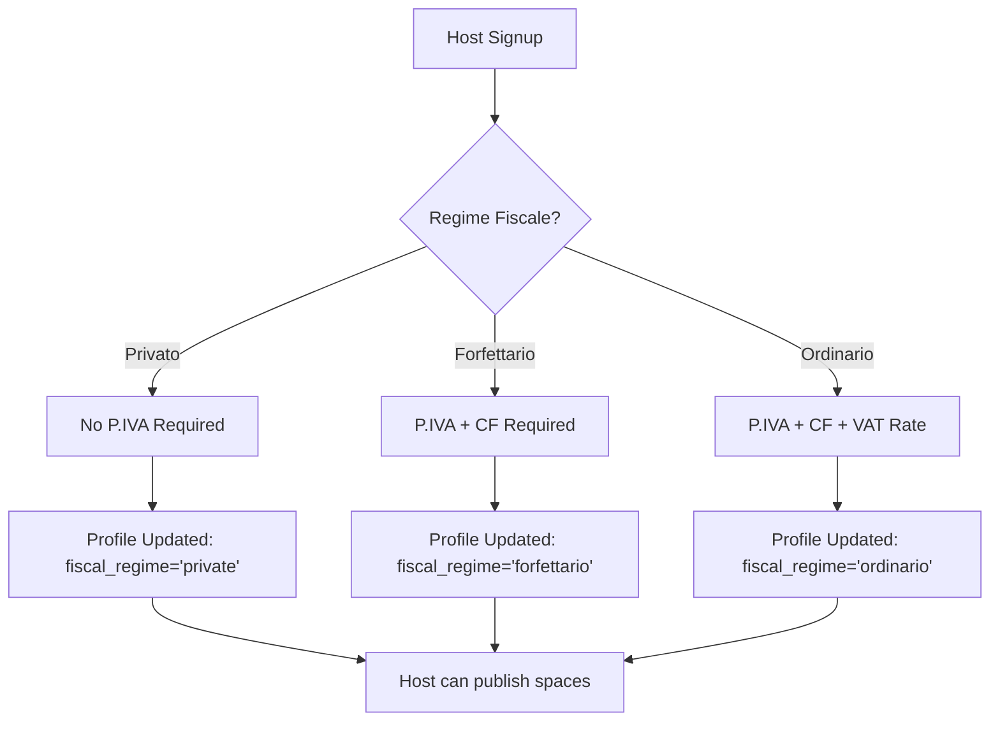
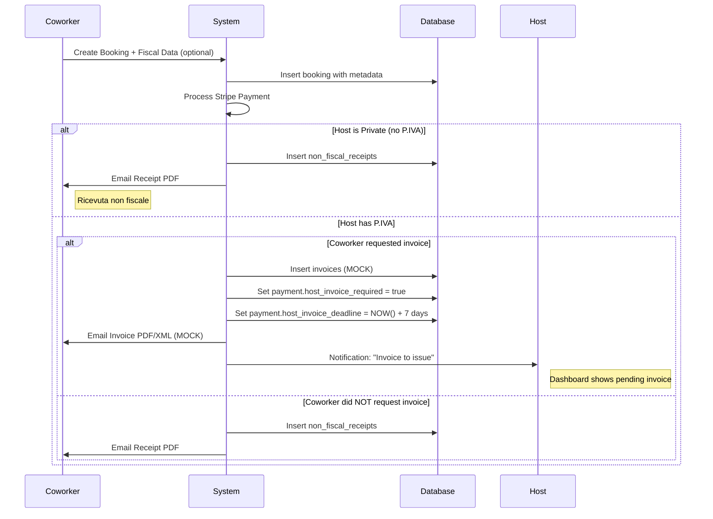
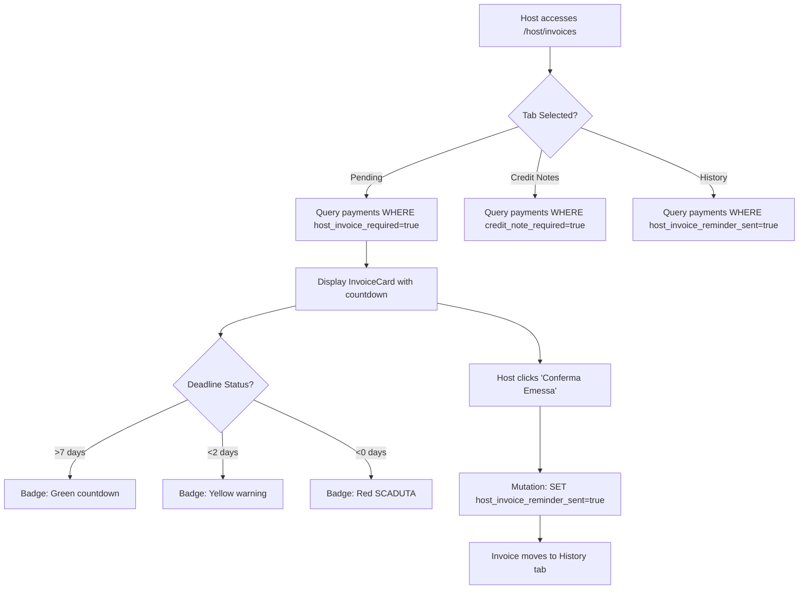
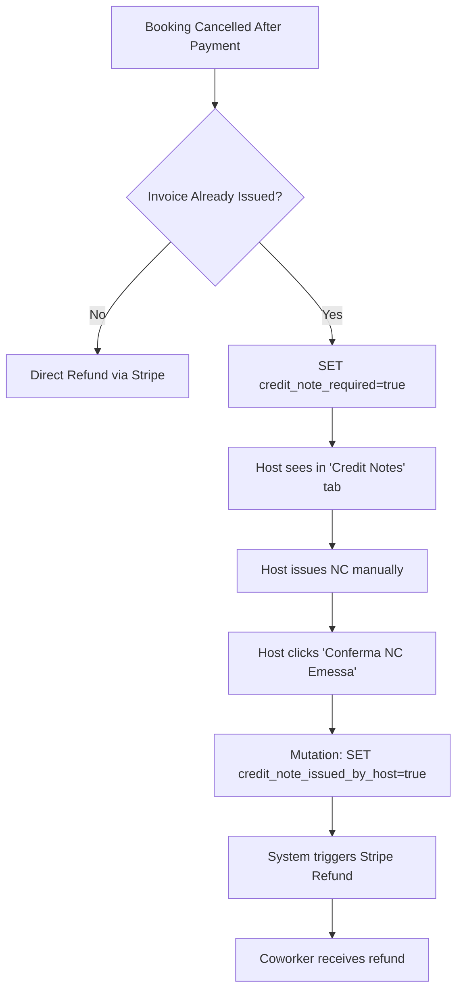

# Modulo Fiscale - Documentazione Tecnica

**WorkOver Fiscal Compliance Module**  
Versione: 1.0  
Ultimo aggiornamento: Gennaio 2025

---

## 📑 Indice

1. [Overview](#overview)
2. [Architettura](#architettura)
3. [Database Schema](#database-schema)
4. [Flussi Principali](#flussi-principali)
5. [API Reference](#api-reference)
6. [Testing](#testing)
7. [Troubleshooting](#troubleshooting)
8. [Future Enhancements](#future-enhancements)

---

## 1. Overview

Il modulo fiscale di WorkOver gestisce la **compliance con la normativa italiana** per la gestione di ricevute e fatture elettroniche nel contesto di transazioni tra host e coworker.

### Obiettivi
- ✅ Supporto completo per **host privati** (no P.IVA) → Ricevute non fiscali
- ✅ Supporto completo per **host P.IVA** → Fatture elettroniche XML
- ✅ Gestione regimi fiscali: **Forfettario** e **Ordinario**
- ✅ Note di credito post-cancellazione
- ✅ Dashboard host con countdown T+7 giorni
- ✅ Archivio documenti coworker con filtri anno fiscale
- ✅ Export CSV per commercialisti

### Normative di Riferimento
- **Fattura Elettronica XML** (D.Lgs. 127/2015)
- **Regime Forfettario** (L. 190/2014, art. 1, commi 54-89)
- **Regime Ordinario IVA** (D.P.R. 633/1972)
- **Note di Credito** (Art. 26 D.P.R. 633/1972)

---

## 2. Architettura

### 2.1 Stack Tecnologico

```
Frontend:
├── React 18.3.1
├── TypeScript
├── React Query (TanStack Query)
├── Tailwind CSS
└── React Hook Form + Zod

Backend:
├── Supabase (PostgreSQL)
├── Row Level Security (RLS)
└── Supabase Storage (fiscal-documents)

Testing:
├── Playwright (E2E)
├── MSW (API mocking)
└── Jest (Unit tests)
```

### 2.2 Componenti Principali

#### Frontend Components
```
src/
├── components/
│   ├── host/
│   │   ├── fiscal/
│   │   │   └── FiscalDashboardContainer.tsx    # Host fiscal regime selector
│   │   └── invoices/
│   │       ├── InvoiceCard.tsx                 # Pending invoice display
│   │       ├── CreditNoteCard.tsx              # Credit note display
│   │       └── InvoiceHistoryTable.tsx         # Historical invoices
│   └── coworker/
│       └── documents/
│           ├── ReceiptCard.tsx                 # Non-fiscal receipt display
│           └── InvoiceCard.tsx                 # Electronic invoice display
├── pages/
│   ├── host/
│   │   ├── HostFiscalPage.tsx                  # Fiscal regime onboarding
│   │   └── HostInvoicesPage.tsx                # Invoice management dashboard
│   └── coworker/
│       └── MyDocumentsPage.tsx                 # Document archive
├── hooks/
│   ├── queries/
│   │   ├── useHostInvoices.ts                  # Host invoice queries
│   │   └── useCoworkerDocuments.ts             # Coworker document queries
│   └── mutations/
│       ├── useConfirmInvoiceIssued.ts          # Mark invoice as issued
│       └── useConfirmCreditNoteIssued.ts       # Mark credit note as issued
└── utils/
    └── documentDownload.ts                     # Secure document download utility
```

#### Database Tables
```sql
profiles
├── fiscal_regime: 'private' | 'forfettario' | 'ordinario'
├── vat_number: TEXT (11 digits)
├── tax_code: TEXT (16 characters)
└── vat_rate: NUMERIC (only for 'ordinario')

bookings
└── metadata: JSONB
    └── fiscal_data: {
        request_invoice: BOOLEAN,
        is_business: BOOLEAN,
        tax_id: TEXT (CF or P.IVA),
        billing_address: TEXT,
        billing_city: TEXT,
        billing_postal_code: TEXT,
        pec_email?: TEXT,
        sdi_code?: TEXT
    }

payments
├── host_invoice_required: BOOLEAN
├── host_invoice_deadline: TIMESTAMP (T+7)
├── host_invoice_reminder_sent: BOOLEAN
├── credit_note_required: BOOLEAN
├── credit_note_deadline: TIMESTAMP
└── credit_note_issued_by_host: BOOLEAN

invoices
├── id: UUID
├── booking_id: UUID → bookings.id
├── payment_id: UUID → payments.id
├── recipient_id: UUID → profiles.id (coworker)
├── invoice_number: TEXT
├── invoice_date: DATE
├── base_amount: NUMERIC (imponibile)
├── vat_rate: NUMERIC
├── vat_amount: NUMERIC
├── total_amount: NUMERIC
├── pdf_file_url: TEXT (Storage path)
├── xml_file_url: TEXT (Storage path)
├── xml_delivery_status: TEXT
└── issuer: TEXT ('WORKOVER_IT')

non_fiscal_receipts
├── id: UUID
├── booking_id: UUID → bookings.id
├── payment_id: UUID → payments.id
├── host_id: UUID → profiles.id
├── coworker_id: UUID → profiles.id
├── receipt_number: TEXT
├── receipt_date: DATE
├── canone_amount: NUMERIC
├── discount_amount: NUMERIC
├── total_amount: NUMERIC
└── pdf_url: TEXT (Storage path)
```

### 2.3 State Management

#### React Query Cache Keys
```typescript
// Host queries
['host-pending-invoices', hostId]
['host-pending-credit-notes', hostId]
['host-invoice-history', hostId, year]

// Coworker queries
['coworker-receipts', coworkerId, year]
['coworker-invoices', coworkerId, year]
['coworker-documents-all', coworkerId, year]
```

#### Mutations
```typescript
// Host actions
useConfirmInvoiceIssued()  // Mark invoice as issued
useConfirmCreditNoteIssued() // Mark credit note as issued

// Coworker actions
(No mutations - read-only access to documents)
```

---

## 3. Database Schema

### 3.1 profiles Table Extensions

```sql
ALTER TABLE profiles
ADD COLUMN fiscal_regime TEXT CHECK (fiscal_regime IN ('private', 'forfettario', 'ordinario')),
ADD COLUMN vat_number TEXT,
ADD COLUMN tax_code TEXT,
ADD COLUMN vat_rate NUMERIC DEFAULT 22.00;
```

**Validations:**
- `vat_number`: Exactly 11 numeric digits (Italian P.IVA format)
- `tax_code`: Exactly 16 alphanumeric characters (Codice Fiscale format)
- `vat_rate`: Only required for `fiscal_regime = 'ordinario'`

### 3.2 bookings.metadata Structure

```typescript
interface BookingMetadata {
  fiscal_data?: {
    request_invoice: boolean;
    is_business: boolean;
    tax_id: string; // CF (16 chars) or P.IVA (11 digits)
    billing_address: string;
    billing_city: string;
    billing_postal_code: string;
    pec_email?: string; // Required if is_business = true
    sdi_code?: string;  // Alternative to PEC (7 chars)
  };
}
```

### 3.3 RLS Policies

#### invoices Table
```sql
-- Coworkers view own invoices
CREATE POLICY "Recipients view own invoices"
ON invoices FOR SELECT
USING (auth.uid() = recipient_id);

-- Hosts view invoices for their bookings
CREATE POLICY "Hosts view own invoices"
ON invoices FOR SELECT
USING (auth.uid() IN (
  SELECT s.host_id 
  FROM spaces s
  JOIN bookings b ON b.space_id = s.id
  WHERE b.id = invoices.booking_id
));

-- Admins view all
CREATE POLICY "Admins view all invoices"
ON invoices FOR SELECT
USING (is_admin(auth.uid()));
```

#### non_fiscal_receipts Table
```sql
-- Coworkers view own receipts
CREATE POLICY "Coworkers view own receipts"
ON non_fiscal_receipts FOR SELECT
USING (auth.uid() = coworker_id);

-- Hosts view receipts they issued
CREATE POLICY "Hosts view own receipts"
ON non_fiscal_receipts FOR SELECT
USING (auth.uid() = host_id);

-- Admins view all
CREATE POLICY "Admins view all receipts"
ON non_fiscal_receipts FOR SELECT
USING (is_admin(auth.uid()));
```

---

## 4. Flussi Principali

### 4.1 Host Fiscal Onboarding



**Validazioni Client-Side:**
```typescript
const fiscalSchema = z.object({
  fiscal_regime: z.enum(['private', 'forfettario', 'ordinario']),
  vat_number: z.string().regex(/^\d{11}$/).optional(),
  tax_code: z.string().regex(/^[A-Z0-9]{16}$/).optional(),
  vat_rate: z.number().min(0).max(100).optional()
}).refine(data => {
  if (data.fiscal_regime === 'private') return true;
  return data.vat_number && data.tax_code;
}, {
  message: "P.IVA e Codice Fiscale obbligatori per regime forfettario/ordinario"
});
```

### 4.2 Booking + Document Generation



### 4.3 Host Invoice Dashboard Flow



**Query Example:**
```typescript
const { data: pendingInvoices } = useQuery({
  queryKey: ['host-pending-invoices', hostId],
  queryFn: async () => {
    const { data, error } = await supabase
      .from('payments')
      .select(`
        *,
        booking:bookings!inner(
          booking_date,
          start_time,
          end_time,
          metadata,
          space:spaces!inner(title),
          coworker:profiles!bookings_user_id_fkey(
            first_name,
            last_name,
            email
          )
        )
      `)
      .eq('booking.space.host_id', hostId)
      .eq('host_invoice_required', true)
      .eq('host_invoice_reminder_sent', false)
      .order('host_invoice_deadline', { ascending: true });
    
    if (error) throw error;
    return data;
  }
});
```

### 4.4 Credit Note Flow



**Business Logic:**
```typescript
// Check if invoice was already issued
const invoiceIssued = payment.host_invoice_reminder_sent === true;

if (invoiceIssued) {
  // Require credit note before refund
  await supabase
    .from('payments')
    .update({
      credit_note_required: true,
      credit_note_deadline: new Date(Date.now() + 7 * 24 * 60 * 60 * 1000)
    })
    .eq('id', paymentId);
} else {
  // Direct refund (invoice not yet issued)
  await processStripeRefund(paymentId);
}
```

---

## 5. API Reference

### 5.1 Supabase Queries

#### Get Host Pending Invoices
```typescript
GET /rest/v1/payments
  ?select=*,booking:bookings!inner(booking_date,space:spaces!inner(title),coworker:profiles!bookings_user_id_fkey(first_name,last_name,email))
  &booking.space.host_id=eq.{hostId}
  &host_invoice_required=eq.true
  &host_invoice_reminder_sent=eq.false
  &order=host_invoice_deadline.asc
```

#### Get Coworker Receipts
```typescript
GET /rest/v1/non_fiscal_receipts
  ?select=*,booking:bookings!inner(booking_date,space:spaces!inner(title)),host:profiles!non_fiscal_receipts_host_id_fkey(first_name,last_name)
  &coworker_id=eq.{coworkerId}
  &receipt_date=gte.{year}-01-01
  &receipt_date=lt.{year+1}-01-01
  &order=receipt_date.desc
```

#### Get Coworker Invoices
```typescript
GET /rest/v1/invoices
  ?select=*,booking:bookings!inner(booking_date,space:spaces!inner(title,host:profiles!spaces_host_id_fkey(first_name,last_name,business_name,vat_number)))
  &recipient_id=eq.{coworkerId}
  &invoice_date=gte.{year}-01-01
  &invoice_date=lt.{year+1}-01-01
  &order=invoice_date.desc
```

### 5.2 Mutations

#### Confirm Invoice Issued
```typescript
PATCH /rest/v1/payments?id=eq.{paymentId}
Content-Type: application/json

{
  "host_invoice_reminder_sent": true
}
```

**React Query Hook:**
```typescript
export const useConfirmInvoiceIssued = () => {
  return useMutation({
    mutationFn: async (paymentId: string) => {
      const { error } = await supabase
        .from('payments')
        .update({ host_invoice_reminder_sent: true })
        .eq('id', paymentId);
      
      if (error) throw error;
    },
    onSuccess: () => {
      queryClient.invalidateQueries({ queryKey: ['host-pending-invoices'] });
      queryClient.invalidateQueries({ queryKey: ['host-invoice-history'] });
    }
  });
};
```

#### Confirm Credit Note Issued
```typescript
PATCH /rest/v1/payments?id=eq.{paymentId}
Content-Type: application/json

{
  "credit_note_issued_by_host": true
}
```

### 5.3 Document Download

```typescript
// Secure download from Supabase Storage
export const downloadDocumentFromStorage = async (
  filePath: string,
  fileName: string
) => {
  const [bucket, ...pathParts] = filePath.split('/');
  const path = pathParts.join('/');
  
  const { data, error } = await supabase.storage
    .from(bucket)
    .download(path);
  
  if (error) throw error;
  
  const url = URL.createObjectURL(data);
  const link = document.createElement('a');
  link.href = url;
  link.download = fileName;
  document.body.appendChild(link);
  link.click();
  document.body.removeChild(link);
  URL.revokeObjectURL(url);
};
```

---

## 6. Testing

### 6.1 E2E Test Suite

Location: `tests/e2e/fiscal/`

**Coverage:**
```
tests/e2e/fiscal/
├── host-onboarding.spec.ts          (8 tests)
├── coworker-checkout.spec.ts        (8 tests)
├── document-generation.spec.ts      (8 tests)
├── host-invoice-dashboard.spec.ts   (8 tests)
└── credit-notes.spec.ts             (7 tests)

Total: 39 E2E tests
```

**Run Commands:**
```bash
# All fiscal E2E tests
npx playwright test tests/e2e/fiscal

# Specific test file
npx playwright test tests/e2e/fiscal/host-onboarding.spec.ts

# With UI
npx playwright test --ui

# Generate HTML report
npx playwright test --reporter=html
npx playwright show-report
```

### 6.2 Mock Data Factories

Location: `tests/factories/mockData.ts`

```typescript
// Host fiscal profile mock
createMockHostFiscalProfile(regime: 'private' | 'forfettario' | 'ordinario')

// Coworker fiscal data mock
createMockCoworkerFiscalData(isBusiness: boolean)

// Invoice mock
createMockInvoice()

// Receipt mock
createMockReceipt()

// Payment mock
createMockPayment()
```

### 6.3 MSW Handlers

Location: `tests/mocks/handlers.ts`

```typescript
// Mock Supabase queries
http.get('*/rest/v1/invoices', ({ request }) => {
  // Return mock invoices
}),

http.get('*/rest/v1/non_fiscal_receipts', ({ request }) => {
  // Return mock receipts
}),

http.patch('*/rest/v1/payments*', async ({ request }) => {
  // Mock payment updates
}),

http.get('*/storage/v1/**', ({ request }) => {
  // Mock document downloads
})
```

---

## 7. Troubleshooting

### 7.1 Common Issues

#### Issue: Fiscal fields not showing in checkout
**Cause:** Host `fiscal_regime` is `'private'`  
**Fix:** Only P.IVA hosts (`forfettario`/`ordinario`) show fiscal toggle to coworker

#### Issue: P.IVA validation failing
**Cause:** P.IVA must be exactly 11 digits  
**Fix:** 
```typescript
vat_number: z.string()
  .regex(/^\d{11}$/, "P.IVA deve essere 11 cifre numeriche")
```

#### Issue: Invoice not appearing in host dashboard
**Cause:** `host_invoice_required` not set on payment  
**Fix:** Verify booking `metadata.fiscal_data.request_invoice = true`

```sql
-- Check booking metadata
SELECT metadata FROM bookings WHERE id = 'booking-id';

-- Check payment flag
SELECT host_invoice_required FROM payments WHERE booking_id = 'booking-id';
```

#### Issue: Credit note required but not showing
**Cause:** Booking cancelled before invoice marked as issued  
**Fix:** Only cancelled bookings with `host_invoice_reminder_sent = true` require NC

```sql
-- Check if invoice was issued before cancellation
SELECT 
  b.cancelled_at,
  p.host_invoice_reminder_sent,
  p.credit_note_required
FROM payments p
JOIN bookings b ON b.id = p.booking_id
WHERE b.id = 'booking-id';
```

#### Issue: Document download failing
**Cause:** RLS policies or missing file in Storage  
**Fix:** 
1. Verify RLS allows `recipient_id` to access file
2. Check file exists in bucket:
```sql
SELECT * FROM storage.objects 
WHERE bucket_id = 'fiscal-documents' 
AND name LIKE '%file-path%';
```

### 7.2 Debugging Queries

#### Check Host Fiscal Configuration
```sql
SELECT 
  id,
  email,
  fiscal_regime,
  vat_number,
  tax_code,
  vat_rate
FROM profiles
WHERE id = 'host-id';
```

#### Check Booking Fiscal Data
```sql
SELECT 
  id,
  booking_date,
  metadata->>'fiscal_data' AS fiscal_data
FROM bookings
WHERE id = 'booking-id';
```

#### Check Payment Invoice Status
```sql
SELECT 
  id,
  host_invoice_required,
  host_invoice_deadline,
  host_invoice_reminder_sent,
  credit_note_required,
  credit_note_issued_by_host
FROM payments
WHERE booking_id = 'booking-id';
```

---

## 8. Future Enhancements

### Short Term (3-6 months)
- [ ] Automated XML submission to Sistema SDI
- [ ] Conservazione sostitutiva integration
- [ ] Multi-language invoice templates (EN, DE, FR)
- [ ] WhatsApp reminders for T+7 deadline
- [ ] Bulk invoice generation for hosts

### Medium Term (6-12 months)
- [ ] DAC7 reporting automation (annual)
- [ ] Commercialista API integration
- [ ] Bulk download (ZIP) for tax year
- [ ] Advanced analytics dashboard
- [ ] Invoice template customization

### Long Term (12+ months)
- [ ] AI-powered invoice data extraction
- [ ] Cross-border EU invoicing (OSS)
- [ ] Integration with Italian accounting software (TeamSystem, Zucchetti)
- [ ] Mobile app invoice management

---

## 📚 Additional Resources

- [Italian Electronic Invoice Specification](https://www.fatturapa.gov.it/export/documenti/fatturapa/v1.2.2/Specifiche_tecniche_del_formato_FatturaPA_v1.2.2.pdf)
- [Regime Forfettario Guide](https://www.agenziaentrate.gov.it/portale/forfettari)
- [Sistema SDI Documentation](https://www.fatturapa.gov.it/export/documenti/fatturapa/v1.2.2/IT01234567890_FPR03.xml.p7m)

---

**Version History:**
- v1.0 (Jan 2025): Initial release with full fiscal compliance module
- v0.9 (Dec 2024): Beta testing phase
- v0.5 (Nov 2024): Core architecture design

**Maintainers:**
- Technical Lead: WorkOver Engineering Team
- Fiscal Compliance: External Tax Advisor
- Security Review: Supabase Team

---

**Last Updated:** 2025-01-15  
**Next Review:** 2025-07-01
