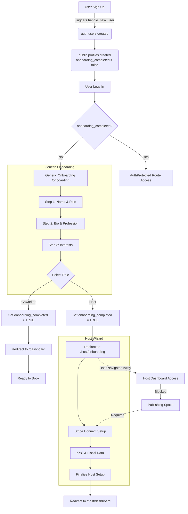

# User Journey Audit: Onboarding & Operational Readiness

**Date:** October 26, 2023
**Scope:** Registration, Generic Onboarding, Host vs. Coworker Flows, Database State.

## 1. The Registration Flow (Common)

The entry point for all users (`Register.tsx`).

*   **Action:** User signs up with Email/Password or Google.
*   **Database Trigger:**
    *   On `INSERT` into `auth.users`, the PostgreSQL trigger `handle_new_user` fires.
    *   **Effect:** Creates a corresponding row in `public.profiles` with the same `id`. Fields like `email` are populated; `onboarding_completed` defaults to `false`.
*   **Immediate Redirection:**
    *   **Email/Password:** User is shown a success toast ("Registrazione completata! Controlla la tua email...") and redirected to `/login`.
    *   **Google:** Handled via Supabase OAuth flow. Upon successful callback, they enter the application state.
*   **Post-Login Routing:**
    *   The `AuthProtected` component intercepts navigation.
    *   If `profile.onboarding_completed` is `false`, the user is forcibly redirected to `/onboarding`.

## 2. The Onboarding Page (`/onboarding`)

This is the generic data collection step for *all* roles (`Onboarding.tsx`).

*   **Mandatory Fields:**
    *   **Step 1:** First Name, Last Name, Role Selection (User vs. Host).
    *   **Step 2:** Profession, Biography (Bio).
    *   **Step 3:** (Validation allows passing without specific inputs here, but UI encourages Interests/Skills).
*   **Role Storage:**
    *   Selected role is stored in the `user_roles` table via an `upsert` on `(user_id, role)`.
*   **Completion Action:**
    *   Upon clicking "Completa registrazione":
        1.  Updates `public.profiles`: Sets `first_name`, `last_name`, `profession`, `bio`, etc.
        2.  **Critical State Change:** Sets `profiles.onboarding_completed = true`.
*   **Redirection Logic:**
    *   **Role = 'user' (Coworker):** Redirects to `/dashboard`.
    *   **Role = 'host' (Host):** Redirects to `/host/onboarding` (The Host Wizard).

## 3. Operational Readiness Analysis

### A. Coworker Flow

*   **Landing:** User lands on `/dashboard`.
*   **Operational Status:** **IMMEDIATELY OPERATIONAL**.
*   **Analysis:**
    *   The user has a profile and is recognized as a 'user'.
    *   **Booking:** They can browse spaces and initiate bookings immediately.
    *   **Payment:** There is *no* requirement to add a credit card during onboarding. The system relies on the Checkout flow (`useCheckout.ts`) to collect payment details (via Stripe Session) at the time of purchase.
    *   **Blockers:** None. The profile is considered complete enough to transact.

### B. Host Flow

*   **Landing:** User is redirected to `/host/onboarding` (Host Wizard).
*   **Operational Status:** **NOT FULLY OPERATIONAL** (Logic Gap Identified).
*   **The "Host Loophole" (Risk):**
    *   Because the generic `Onboarding.tsx` sets `onboarding_completed = true` *before* the redirect to the Host Wizard, the system technically considers the user "onboarded".
    *   If the user navigates away from the Wizard (e.g., clicks "Dashboard" or changes URL), `AuthProtected` **will allow them access** to the Host Dashboard because the primary gate (`onboarding_completed`) is open.
*   **Critical Next Steps (Enforced via UI/Logic):**
    1.  **Stripe Connect:** Required to receive payments.
        *   *Enforcement:* The Host Wizard (`HostOnboardingWizard.tsx`) prevents completion without `stripe_connected`.
        *   *Loophole Mitigation:* If they skip the wizard, they can access the dashboard, but `useSpaceFormSubmission` blocks publishing a space if `stripeOnboardingStatus !== 'completed'`.
    2.  **KYC Verification:**
        *   *Enforcement:* Part of the Wizard flow (Step 2.5).
    3.  **Fiscal Data:**
        *   *Enforcement:* Part of the Wizard flow (Step 3).

## 4. Visual Flowchart

## 5. Identified Gaps & Blockers

### 🔴 High Priority: The Host Onboarding Loophole
*   **Issue:** The flag `onboarding_completed` is set to `true` in the generic onboarding step (`Onboarding.tsx`), *before* the Host completes their specific requirements (Stripe, KYC).
*   **Consequence:** A Host can abandon the Wizard and still access the platform as a "verified" user. While they cannot publish spaces (due to secondary checks in `useSpaceFormSubmission`), they enter the Dashboard in a "zombie" state—nominally onboarded but functionally useless.
*   **Recommendation:** Refactor `Onboarding.tsx` to **NOT** set `onboarding_completed = true` for Hosts. Instead, pass them to `/host/onboarding` with the flag still `false`. Only `HostOnboardingWizard` should set the flag to `true` upon successful completion of Stripe/KYC.

### 🟡 Medium Priority: Redundant "Onboarding Completed" Set
*   **Issue:** `HostOnboardingWizard.tsx` calls `updateProfile({ onboarding_completed: true })` at the end. This is redundant in the current flow because it was already set, but it confirms the *intent* that this should be the final gate.

### 🟢 Operational Readiness: Coworker
*   **Status:** Healthy. The "Lazy Registration" of payment methods (at checkout) is a standard pattern that reduces friction. No blockers identified.
