# ADR 004: Error Monitoring - Sentry

## Status
**Accepted** - 2024-02-10

## Context
We needed comprehensive error monitoring and performance tracking for production, with alerting, source maps, and user context to diagnose issues quickly.

## Decision
We chose **Sentry** for error monitoring and performance tracking, integrated with **PostHog** for product analytics.

## Rationale

### Sentry Pros
- **Error tracking**: Automatic error capture with stack traces
- **Performance monitoring**: Real User Monitoring (RUM)
- **Session replay**: Visual reproduction of user sessions
- **Source maps**: De-minified stack traces
- **Release tracking**: Associate errors with deployments
- **Breadcrumbs**: User actions leading to errors
- **Context enrichment**: User, browser, device info
- **Integrations**: Slack, GitHub, Jira
- **Privacy controls**: PII scrubbing, data filtering

### PostHog Pros
- **Product analytics**: User behavior tracking
- **Feature flags**: A/B testing and gradual rollouts
- **Session recording**: User session replay
- **Open source**: Can self-host
- **Privacy-first**: GDPR compliant

## Architecture

```mermaid
graph LR
    A[User Action] --> B{Error Occurs?}
    B -->|Yes| C[Sentry]
    B -->|No| D[PostHog]
    
    C --> E[Error Dashboard]
    C --> F[Slack Alert]
    C --> G[Session Replay]
    
    D --> H[Analytics Dashboard]
    D --> I[Funnel Analysis]
    D --> J[Feature Flags]
    
    style C fill:#362D59
    style D fill:#1D4AFF
```



## Alternatives Considered

### LogRocket
- **Rejected**: More expensive
- **Rejected**: Overkill for our needs
- **Could reconsider**: If we need advanced session replay

### Rollbar
- **Rejected**: Less feature-rich than Sentry
- **Rejected**: Weaker performance monitoring

### DataDog
- **Rejected**: Significantly more expensive
- **Rejected**: Complex setup for our scale

### Google Analytics
- **Rejected**: Not suitable for error monitoring
- **Using**: PostHog instead for better privacy

## Implementation Guidelines

### Sentry Configuration
```typescript
Sentry.init({
  dsn: import.meta.env.VITE_SENTRY_DSN,
  environment: import.meta.env.MODE,
  tracesSampleRate: 0.1, // 10% of transactions
  replaysSessionSampleRate: 0.1, // 10% of sessions
  replaysOnErrorSampleRate: 1.0, // 100% of error sessions
  
  beforeSend(event, hint) {
    // Filter PII
    if (event.request?.headers) {
      delete event.request.headers['Authorization'];
    }
    return event;
  },
});
```

### Error Capture
```typescript
// ✅ Automatic capture
throw new Error('Something went wrong');

// ✅ Manual capture with context
Sentry.captureException(error, {
  tags: { feature: 'booking' },
  contexts: {
    booking: { spaceId, date, userId },
  },
});

// ✅ Breadcrumbs
Sentry.addBreadcrumb({
  message: 'User started booking',
  level: 'info',
  data: { spaceId },
});
```

### Performance Monitoring
```typescript
// ✅ Custom transactions
const transaction = Sentry.startTransaction({
  name: 'Create Booking',
  op: 'booking',
});

try {
  await createBooking(data);
  transaction.setStatus('ok');
} catch (error) {
  transaction.setStatus('error');
  throw error;
} finally {
  transaction.finish();
}
```

### Privacy & Compliance

#### PII Scrubbing
- Automatic scrubbing of common PII patterns
- Custom `beforeSend` hook for additional filtering
- Exclude sensitive form fields

#### Data Retention
- Errors: 90 days
- Performance data: 30 days
- Session replays: 30 days
- User consent required for session replay

#### GDPR Compliance
- User right to be forgotten (delete data)
- Data export capability
- Minimal data collection
- Clear consent mechanism

## Alert Configuration

### Critical Alerts (Slack)
- Production errors (> 10/min)
- Payment failures
- Database connection issues
- Authentication errors

### Warning Alerts (Email)
- Performance degradation (> 3s load time)
- High error rate (> 5%)
- Failed deployments

## Consequences

### Positive
- Proactive error detection
- Faster issue resolution
- Better understanding of user behavior
- Data-driven decision making
- Improved user experience

### Negative
- Additional cost (~$50/month estimated)
- Privacy concerns (mitigated with filtering)
- Configuration complexity
- Must train team on tools

## Metrics Tracking

### Error Metrics
- Error rate per deployment
- Mean time to resolution (MTTR)
- Error-free sessions percentage
- Top errors by frequency

### Performance Metrics
- Page load time (LCP)
- First Input Delay (FID)
- Cumulative Layout Shift (CLS)
- API response times

## Review Date
2025-09-01 - Reassess costs and alternative tools
