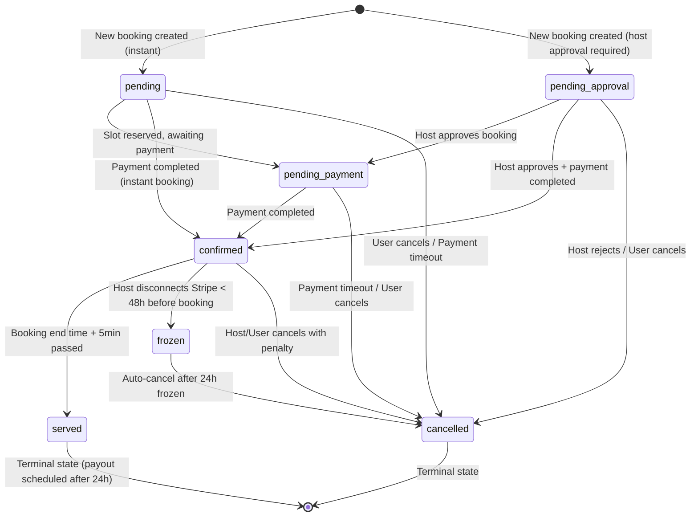

# ONDATA 2: FIX 2.8 - BOOKING STATUS FLOW DIAGRAM

## Booking Status State Machine

This document describes all valid booking status transitions and the business logic behind each state.



## Status Definitions

### **pending**
- **Description**: Initial status for instant bookings
- **Business Logic**: 
  - Space has `confirmation_type = 'instant'`
  - Payment slot reserved for 15 minutes
  - User must complete payment before slot expires
- **Next States**: `pending_payment`, `confirmed`, `cancelled`

### **pending_approval**
- **Description**: Initial status for bookings requiring host approval
- **Business Logic**:
  - Space has `confirmation_type = 'host_approval'`
  - Host has 24h to approve/reject
  - No payment required until approval
  - Automated reminder sent to host after 12h
- **Next States**: `pending_payment`, `confirmed`, `cancelled`

### **pending_payment**
- **Description**: Booking approved but payment not yet completed
- **Business Logic**:
  - Slot reserved for user
  - Payment deadline: 24h from approval (instant) or 12h (host approval)
  - Automated reminder sent 2h before deadline
  - Auto-cancelled if payment not received by deadline
- **Next States**: `confirmed`, `cancelled`

### **confirmed**
- **Description**: Booking confirmed with completed payment
- **Business Logic**:
  - Payment successfully processed via Stripe
  - Space locked for booking time slot
  - Cancellation penalties apply if user/host cancels
  - Host payout scheduled for 24h after service completion
- **Next States**: `served`, `frozen`, `cancelled`

### **frozen**
- **Description**: Booking frozen due to host Stripe disconnection
- **Business Logic**:
  - Host disconnected Stripe account within 48h of booking start
  - User notified immediately
  - Host has 24h to reconnect Stripe or booking auto-cancels
  - Full refund issued to user if auto-cancelled
- **Next States**: `cancelled`

### **served**
- **Description**: Booking service completed (terminal state)
- **Business Logic**:
  - Automatically set by cron job 5 min after `booking_date + end_time`
  - Review period starts (14 days for both host and coworker)
  - Host payout scheduled 24h after service completion
  - Requires both parties to review before payout
- **Next States**: None (terminal)

### **cancelled**
- **Description**: Booking cancelled by user, host, or system (terminal state)
- **Business Logic**:
  - Cancellation fee calculated based on time before booking
  - Refund processed automatically via Stripe
  - Cancellation reason logged for analytics
  - Host penalty if host cancels (12.2% platform fee)
- **Next States**: None (terminal)

## Status Transition Triggers

### User Actions
- **Create Booking**: `[*] → pending` or `[*] → pending_approval`
- **Complete Payment**: `pending_payment → confirmed`
- **Cancel Booking**: Any non-terminal → `cancelled` (with penalty)

### Host Actions
- **Approve Booking**: `pending_approval → pending_payment` or `confirmed`
- **Reject Booking**: `pending_approval → cancelled`
- **Cancel Booking**: `confirmed → cancelled` (with penalty)
- **Disconnect Stripe**: `confirmed → frozen` (if < 48h before booking)

### System Actions (Automated)
- **Mark as Served**: `confirmed → served` (cron: every 5 min)
- **Auto-cancel Expired**: `pending_payment → cancelled` (cron: hourly)
- **Auto-cancel Frozen**: `frozen → cancelled` (cron: hourly, after 24h)
- **Schedule Payout**: `served` booking triggers payout scheduling (cron: hourly, 24h delay)

## Cancellation Fee Logic

### Coworker Cancels (Standard Booking)
```
Days until booking | Fee (Standard)
< 1 day            | 50%
< 3 days           | 50%
< 7 days           | 25%
>= 7 days          | Free
```

### Coworker Cancels (Instant Booking)
```
Days until booking | Fee (Instant)
< 1 day            | 50%
< 3 days           | 30%
< 7 days           | 15%
>= 7 days          | Free
```

### Host Cancels
```
Fixed fee: 12.2% of base amount (platform penalty)
User receives: Full refund (100%)
```

### System Auto-cancel (Frozen)
```
Fee: 0% (full refund to user)
Host penalty: 12.2% platform fee
```

## Edge Cases & Special Rules

1. **Payment Timeout**: `pending_payment` bookings auto-cancel if payment not received within deadline
2. **Host Approval Timeout**: `pending_approval` bookings auto-cancel if host doesn't respond within 24h
3. **Frozen Bookings**: Host has 24h to reconnect Stripe, else booking auto-cancels with full refund
4. **Review Requirements**: Both host and coworker must submit reviews before payout is released
5. **Dispute Handling**: `confirmed` or `served` bookings with payment disputes freeze payout until resolved

## Database Trigger Validation

All status transitions are validated by the `validate_booking_status_transition()` trigger:
- Prevents invalid state jumps (e.g., `pending → served`)
- Enforces state machine rules
- Raises exceptions for unauthorized transitions

## Monitoring & Alarms

System alarms are created for:
- **High**: Failed status transitions
- **Critical**: Frozen bookings not auto-cancelled after 48h
- **Medium**: Payment timeouts exceeding threshold (>10/hour)

See `system_alarms` table for active alerts.
